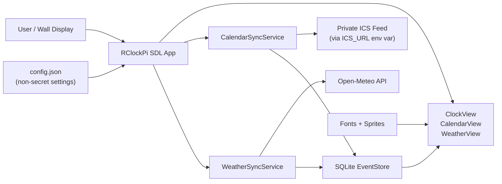

# RClockPi

**A fullscreen Raspberry Pi dashboard that turns wall-mounted hardware into a reliable calendar, clock, and weather display.**

## Problem -> Solution

**Problem**
- Shared spaces need a glanceable display for time, upcoming events, and weather.
- Browser-based dashboards are often fragile in kiosk setups, depend on constant connectivity, and expose too much operational overhead.

**Solution**
- `RClockPi` is a native SDL2 kiosk app built for Raspberry Pi OS.
- It renders fullscreen views locally, syncs calendar and weather data in the background, caches data in SQLite, and keeps running even when connectivity is unstable.

## Demo

- Live demo: `[Add deployed video / GIF link here]`
- Screenshots: `[Add screenshot folder or portfolio link here]`
- Resume one-liner: `Built a Raspberry Pi kiosk dashboard with offline caching, background sync, and fullscreen native rendering.`

## Features

- **Always-on kiosk UX**: fullscreen interface optimized for wall displays and passive viewing.
- **Offline resilience**: events and weather are cached locally in SQLite so the device remains useful during outages.
- **Low-friction operations**: `run_clock.sh` builds, launches, logs, restarts on crashes, and prevents idle sleep.
- **Secure config model**: sensitive calendar access stays in environment variables, not in tracked config.
- **Multiple information modes**: clock, calendar, and weather views are navigable from one lightweight app.
- **Input hardening**: config, ICS input, and persisted event data are validated to reduce malformed-data failures.

## Architecture



## Tech Stack

- **C++17**: predictable performance and low runtime overhead for embedded/kiosk deployment.
- **SDL2 + SDL2_ttf + SDL2_image**: native fullscreen rendering, font loading, and image/sprite support.
- **libcurl**: background HTTP fetches for calendar and weather synchronization.
- **SQLite**: lightweight local persistence for offline-first reads.
- **nlohmann/json**: simple, readable config parsing for kiosk settings.
- **CMake**: portable build system for Raspberry Pi and Linux environments.
- **Bash launcher**: operational wrapper for build, restart, logging, and kiosk-friendly runtime behavior.

## Installation

### 1. Clone the repository

```bash
git clone https://github.com/LeeGisKer/RClockPi-4-B.git
cd RClockPi-4-B
```

### 2. Install dependencies on Raspberry Pi OS / Debian

```bash
sudo apt update
sudo apt install -y \
  build-essential cmake pkg-config \
  libsdl2-dev libsdl2-ttf-dev libsdl2-image-dev \
  libcurl4-openssl-dev libsqlite3-dev \
  nlohmann-json3-dev ca-certificates fonts-dejavu-core
```

### 3. Create local config

```bash
cp config/config.example.json config/config.json
```

Update `config/config.json` as needed:
- `font_path`: path to a `.ttf` font
- `db_path`: local SQLite file
- `mock_mode`: use sample data for UI testing
- `weather_enabled`, `weather_latitude`, `weather_longitude`: enable live weather
- `sprite_dir`, `weather_sprite_dir`: artwork directories

### 4. Export the calendar secret

Linux/macOS:

```bash
export ICS_URL="https://calendar.google.com/calendar/ical/your-secret/basic.ics"
```

PowerShell:

```powershell
$env:ICS_URL = "https://calendar.google.com/calendar/ical/your-secret/basic.ics"
```

## Usage

### Option A: Build and run through the kiosk launcher

```bash
chmod +x run_clock.sh
./run_clock.sh
```

### Option B: Build manually

```bash
cmake -S . -B build
cmake --build build -j4
./build/rpi_calendar config/config.json
```

### Runtime controls

- `Space`: cycle `Clock -> Calendar -> Weather`
- `Esc`: quit
- `S`: save a screenshot to `data/preview.bmp`

### Useful launcher environment variables

```bash
export RESTART_ON_EXIT=1
export RESTART_DELAY_SEC=2
export LOG_FILE="./logs/rpi_calendar.log"
```

## Challenges & Learnings

- **Designing for unreliable connectivity**: caching calendar and weather data locally makes the kiosk useful beyond the network happy path.
- **Separating secrets from config**: moving the private ICS URL to environment variables avoids leaking access in tracked files.
- **Balancing UI simplicity with operational reliability**: a kiosk app needs more than rendering; restart behavior, logging, and screen-wake handling matter in production.
- **Native app ergonomics on constrained hardware**: SDL2 provides direct control, but it also requires careful resource handling and explicit dependency setup.

## Future Improvements

- Add systemd service files for one-command boot-to-kiosk deployment.
- Restrict redirect handling and path resolution further for stricter security posture.
- Add automated tests for config validation, ICS parsing, and persistence logic.
- Support multiple calendars and richer filtering for family/team scheduling use cases.
- Add a polished demo video and screenshots for portfolio and recruiter review.

## Project Snapshot

- **Domain**: embedded UI / kiosk software
- **Primary use case**: always-on household or office information display
- **Key engineering themes**: offline-first caching, background sync, native rendering, secure configuration
